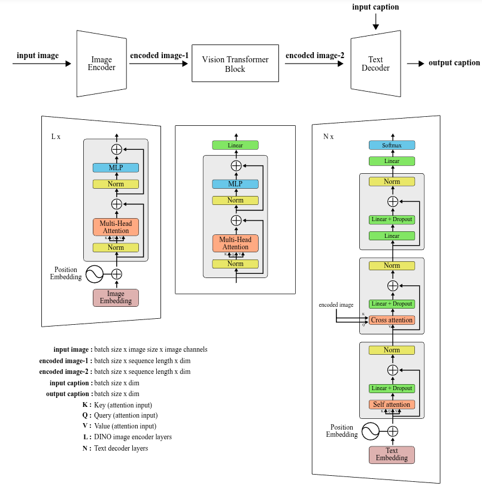

# TRCaptionNet++

TRCaptionNet++: A high-performance encoder-decoder based deep Turkish image captioning model fine-tuned with a large-scale set of pretrain data.

<p align="center">
    <a href="https://journals.tubitak.gov.tr/elektrik/vol33/iss5/10/"></a>
    <a href="https://serdaryildiz.com/TRCaptionNetpp/"></a>
    <a href="https://huggingface.co/spaces/serdaryildiz/TRCaptionNetpp"></a>
    <a href="https://drive.google.com/uc?id=1tOiRtIpe99gQWnpGfy_W5xgtsHFhvU3F"></a>
</p>

## Overview

TRCaptionNet++ is an encoder-decoder-based model developed for generic Turkish image captioning. It combines an image encoder, a vision transformer projection block, and a BERT-based text decoder. The model is refined using a large-scale pretraining set containing approximately 2 million images and 8 million automatically generated captions.

The model was evaluated on TasvirEt, Turkish MS COCO, and machine-translated versions of MS COCO and Flickr30K using BLEU, METEOR, ROUGE-L, CIDEr, and SPICE metrics.

## Architecture

<p align="center">
  
</p>

## Pretrained Model

The pretrained **TRCaptionNet++ Large** checkpoint is available on [Google Drive](https://drive.google.com/uc?id=1tOiRtIpe99gQWnpGfy_W5xgtsHFhvU3F). The demo application in `app.py` downloads this checkpoint automatically to `checkpoints/TRCaptionNetpp_Large.pth`.

## Training

Before training, select a configuration from `configs/` and update its dataset, annotation, output, and pretrained checkpoint paths for your environment. To train the DINOv2 ViT-L/14 and ELECTRA-based model on TasvirEt, run:

```bash
python train.py \
    --config configs/tasviret/tasviret_exp2_base16_electra_dino2.yaml
```

Configurations are provided for COCO, Flickr30K, TasvirEt, TurkCap8M, and Turkish MS COCO. Training checkpoints and TensorBoard logs are written under the `save_dir/save_name` path defined in the selected YAML file.

## Testing

Download the pretrained model and place it at `checkpoints/TRCaptionNetpp_Large.pth`. The following example evaluates TRCaptionNet++ Large on TasvirEt:

```bash
python eval.py \
    --config configs/tasviret/tasviret_exp2_base16_electra_dino2.yaml \
    --weights checkpoints/TRCaptionNetpp_Large.pth \
    --dataset tasviret \
    --test-data data/flickr/flickr30k-images \
    --test-json data/tasvir-et/tasvir_test.json \
    --device cuda:0
```

The `--dataset` argument accepts `coco`, `flickr`, `tasviret`, or `TurkishMSCOCO`. Evaluation results for BLEU, METEOR, ROUGE-L, CIDEr, and SPICE are displayed and appended to `results.xlsx`.

## Demo

Try TRCaptionNet++ online through the [Hugging Face Space](https://huggingface.co/spaces/serdaryildiz/TRCaptionNetpp). Upload an image to generate a Turkish caption and adjust the minimum caption length and repetition penalty from the interface.

The project page, additional details, and examples are available at [serdaryildiz.com/TRCaptionNetpp](https://serdaryildiz.com/TRCaptionNetpp/).

## Citation

If you use this repository in your research, please cite:

```bibtex
@article{yildiz2025trcaptionnet++,
  title={TRCaptionNet++: A high-performance encoder-decoder based deep Turkish image captioning model fine-tuned with a large-scale set of pretrain data},
  author={Yildiz, Serdar and MEM{\.I}{\c{S}}, ABBAS and VARLI, SONG{\"U}L},
  journal={Turkish Journal of Electrical Engineering and Computer Sciences},
  volume={33},
  number={5},
  pages={669--687},
  year={2025},
  publisher={The Scientific and Technological Research Council of T{\"u}rkiye (T{\"U}B{\.I}TAK)}
}
```
